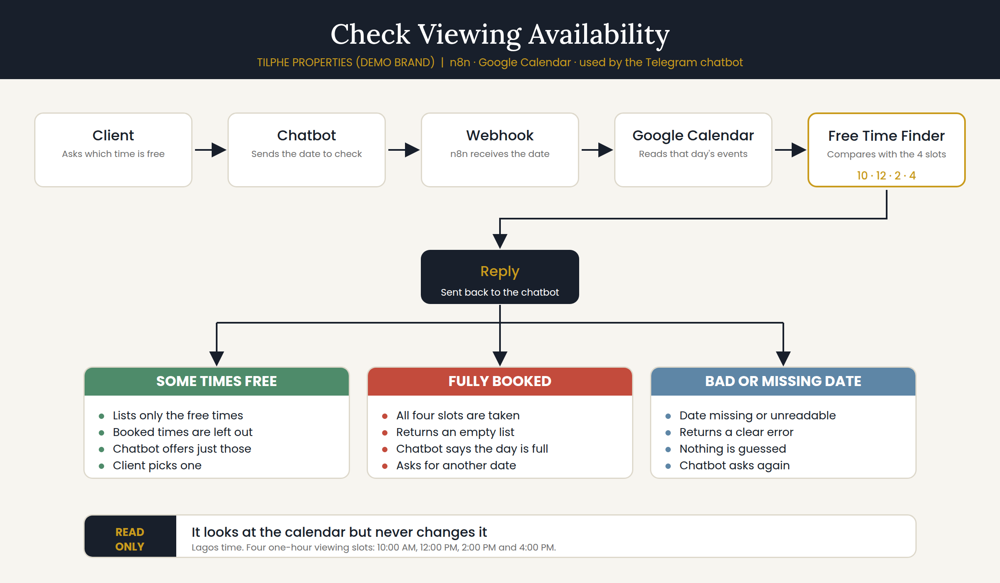
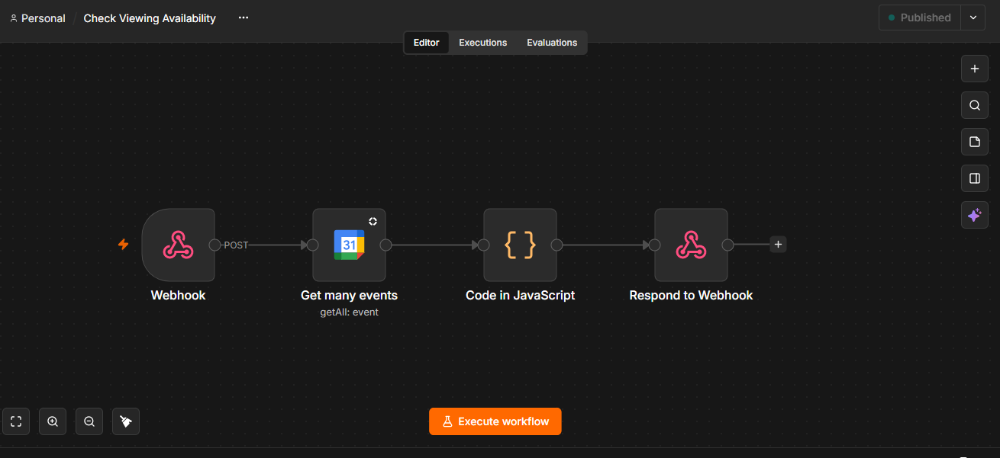
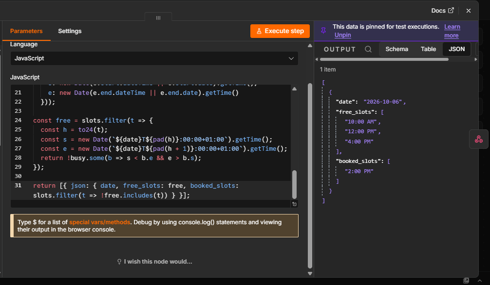
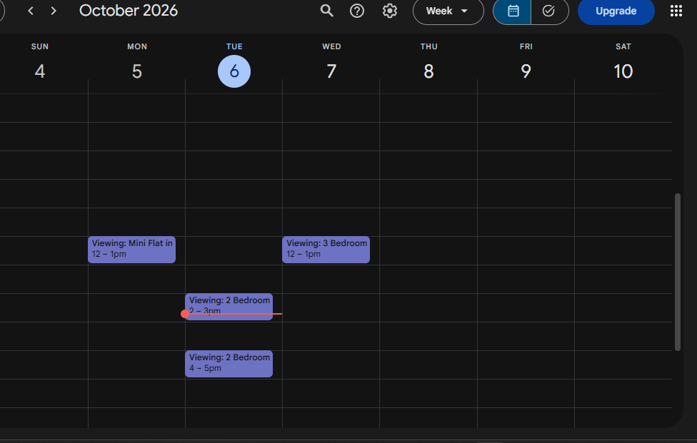
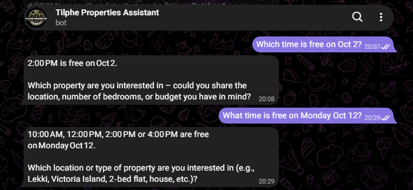

# Check Viewing Availability

**A small helper that tells the property chatbot which viewing times are really free, so it never offers a time that is already taken.**

Built as part of a real estate automation suite for **Tilphe Properties**, a demo brand created for this portfolio.

---

## The problem

Every agent has been here. A client asks, *"Is 2pm free on Friday?"* You say yes. Then you open your diary and see you already have a viewing at 2pm.

Now you have to go back to the client, apologise, and offer another time. It looks careless, and some clients simply move on to another agent.

An AI assistant makes this worse if it works from memory. During my own testing, my chatbot listed all four viewing times as available, and a moment later told the client, *"Sorry, that time is already taken."*

A client should only ever be offered times that are really free.

---

## The solution

Before the assistant offers any viewing time, it asks this helper a simple question: **"What is free on this day?"**

The helper:

1. Receives the date from the chatbot
2. Looks at the agent's **real Google Calendar** for that day
3. Compares it with the four viewing slots: **10:00 AM, 12:00 PM, 2:00 PM and 4:00 PM**
4. Sends back only the times that are free

The assistant then offers the client just those times.

---

## Example

> **Client:** Which time is free on Friday?
>
> *(The calendar already has viewings at 10:00 AM, 12:00 PM and 4:00 PM.)*
>
> **Assistant:** 2:00 PM is free on Friday. Would you like to book it?

---

## What it handles

| Situation | What happens |
|---|---|
| Nothing booked that day | All four times are offered |
| Some viewings already booked | Only the free times are offered |
| The whole day is booked | The assistant says the day is full and asks for another date |
| The date is missing or unclear | A clear error is returned, and the assistant asks again |

---

## How it helps a real estate business

- **No embarrassing reversals.** The client is never promised a time that is gone.
- **Your calendar stays the one source of truth.** Whatever is in your diary is what the assistant sees.
- **Less back and forth.** The client sees the free times at once and picks one.
- **Nothing to learn.** It uses the Google Calendar the agent already has.
- **Safe.** It only *looks* at the calendar. It never adds, moves or deletes anything.

---

## Where it fits

This helper is one part of the real estate suite:

| Part | Its job |
|---|---|
| **Property Enquiry Chatbot** | Talks to clients, shows properties, takes their details |
| **Check Viewing Availability** (this project) | Tells the chatbot which times are free |
| **Property Viewing Booking** | Books the viewing, emails the client, updates the record |
| **Lead Capture & Qualification** | Grades every lead Hot, Warm or Cold |

---

## See it in action

### 1. The helper at work
The whole workflow on one screen.

### 2. Checking a real day
A day with three viewings already booked. The helper returns the one free time.

### 3. The agent's calendar
The calendar the helper reads.

### 4. What the client sees
The chatbot offers only the free time.

---

## What I tested

- A day with three viewings booked → only the one free time was returned
- A day with nothing booked → all four times were returned
- Booking a time after checking → the viewing was confirmed

---

## What went wrong along the way

- **The first version of the chatbot guessed.** It listed all four times from memory and was wrong. This helper exists to fix exactly that.
- **An empty day could stop the process.** When nothing is booked, the calendar returns nothing. I set it so an empty day is treated as "all times free".

---

## What I would add next

- Hide times that have already passed today
- Let each agent set their own viewing times and length
- Check several agents' calendars at once
- Suggest the next free day automatically when a day is full

---

## Built with

n8n · Google Calendar · used by a Telegram chatbot

---

**Built by Tiphe**, AI Automation. Open to remote work and freelance projects.
